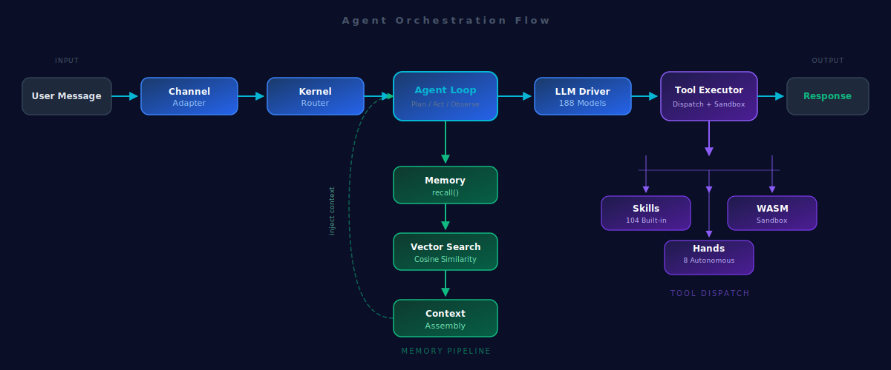
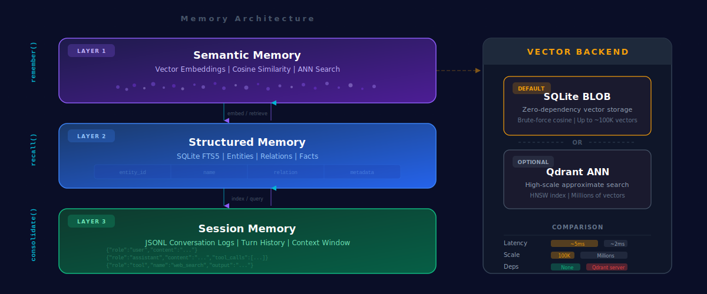

<p align="center">
  
</p>

<p align="center">
  <strong>Open-source Agent OS built in Rust. 14 crates. 2,285+ tests. Zero clippy warnings.</strong><br/>
  One binary. 104 skills. 40 channels. 188 models. Agents that actually work.
</p>

<p align="center">
  
  
  
  
  
</p>

<p align="center">
  <a href="#quick-start">Quick Start</a> •
  <a href="#architecture">Architecture</a> •
  <a href="#features">Features</a> •
  <a href="#configuration">Configuration</a> •
  <a href="#api-reference">API</a> •
  <a href="#contributing">Contributing</a>
</p>

---

## What is Mohini?

Mohini is a **single Rust binary** that gives AI models the ability to act autonomously — browsing the web, managing files, sending messages, running code, and orchestrating multi-agent workflows. Think of it as an operating system where the "user" is an AI agent.

<p align="center">
  
</p>

---

## Features

<table>
<tr>
<td width="50%">

### Core Engine
- **14 Rust crates** — modular, zero-copy architecture
- **104 bundled skills** + 109 community skills across 30 categories
- **53 built-in tools** — file I/O, web fetch, shell exec, code analysis
- **WASM sandbox** — secure skill execution via Wasmtime
- **SQLite + Qdrant** — dual-backend vector memory for semantic recall

</td>
<td width="50%">

### Connectivity
- **40 channel adapters** — WhatsApp, Telegram, Discord, Slack, Signal, iMessage, Email, Matrix, IRC, and more
- **188 model catalog** — OpenAI, Anthropic, Google, Groq, Mistral, NVIDIA NIM, Ollama, vLLM, LM Studio
- **WebSocket gateway** — real-time multiplexed connections with presence tracking
- **Agent-to-Agent protocol** — MMP network for multi-agent coordination

</td>
</tr>
<tr>
<td width="50%">

### Autonomous Hands
- **Researcher** — deep web research with source citation
- **Browser** — headless Chrome automation
- **Trader** — market data analysis
- **Collector** — data aggregation pipelines
- **Predictor** — forecasting engine

</td>
<td width="50%">

### Developer Experience
- **Web dashboard** — Alpine.js SPA at `localhost:4200`
- **A2UI Canvas** — interactive visual canvas for agent output
- **Voice wake** — configurable wake word detection
- **Media pipeline** — MIME detection, image optimization, audio transcription
- **Hot config reload** — change settings without restart

</td>
</tr>
</table>

---

## Architecture

<p align="center">
  
</p>

Mohini is composed of 14 Rust crates that compile into a single binary:

```
mohini/
├── crates/
│   ├── mohini-types/        # Shared types, config, errors
│   ├── mohini-memory/       # SQLite + Qdrant vector memory
│   ├── mohini-runtime/      # Agent loop, LLM drivers, 53 tools
│   ├── mohini-wire/         # MMP wire protocol (agent-to-agent)
│   ├── mohini-api/          # Axum REST/WS/SSE server + dashboard
│   ├── mohini-kernel/       # Orchestration engine
│   ├── mohini-cli/          # CLI entry point
│   ├── mohini-channels/     # 40 messaging adapters
│   ├── mohini-skills/       # Skill registry + 104 bundled skills
│   ├── mohini-hands/        # 8 autonomous hands
│   ├── mohini-migrate/      # Migration from other frameworks
│   ├── mohini-extensions/   # Extension system
│   └── mohini-desktop/      # Tauri desktop app
├── agents/                  # Agent TOML definitions
├── deploy/                  # systemd, Docker configs
├── scripts/                 # Install scripts
└── sdk/                     # Python SDK
```

### Agent Orchestration Flow

<p align="center">
  
</p>

The kernel receives messages from any of the 40 channel adapters, routes them to the appropriate agent, which then uses the LLM driver to generate responses. Agents can invoke tools, recall memories, and coordinate with other agents via the MMP wire protocol.

### Memory Architecture

<p align="center">
  
</p>

Mohini's memory system supports dual backends:
- **SQLite** (default) — embedded, zero-config, brute-force cosine similarity
- **Qdrant** (optional) — ANN vector search for production-scale deployments

Memories are automatically decayed, accessed-count boosted, and semantically recalled using embedding vectors.

---

## Quick Start

### Prerequisites

| Tool | Version | Install |
|------|---------|---------|
| **Rust** | 1.75+ | `curl --proto '=https' --tlsv1.2 -sSf https://sh.rustup.rs \| sh` |
| **C toolchain** | gcc/clang | Ubuntu: `sudo apt install build-essential pkg-config libssl-dev` |
| | | macOS: `xcode-select --install` |

### 1. Clone & Build

```bash
git clone https://github.com/darshjme/mohini.git
cd mohini
cargo build --release -p mohini-cli
```

> First build compiles ~826 dependencies and takes ~10 minutes. The binary lands at `target/release/mohini`.

### 2. Initialize

```bash
./target/release/mohini init
```

Creates `~/.mohini/` with default configuration.

### 3. Configure a Provider

Edit `~/.mohini/config.toml`:

<details>
<summary><b>NVIDIA NIM — Kimi K2.5 (free tier)</b></summary>

Get key at [build.nvidia.com](https://build.nvidia.com/)

```toml
[default_model]
provider = "nvidia"
model = "moonshotai/kimi-k2-instruct"
base_url = "https://integrate.api.nvidia.com/v1"
api_key_env = "NVIDIA_API_KEY"
```
```bash
export NVIDIA_API_KEY="nvapi-your-key-here"
```
</details>

<details>
<summary><b>OpenAI — GPT-4o</b></summary>

```toml
[default_model]
provider = "openai"
model = "gpt-4o"
api_key_env = "OPENAI_API_KEY"
```
```bash
export OPENAI_API_KEY="sk-..."
```
</details>

<details>
<summary><b>Anthropic — Claude</b></summary>

```toml
[default_model]
provider = "anthropic"
model = "claude-sonnet-4-20250514"
api_key_env = "ANTHROPIC_API_KEY"
```
```bash
export ANTHROPIC_API_KEY="sk-ant-..."
```
</details>

<details>
<summary><b>Groq — Llama 3.3 70B (free tier)</b></summary>

Get key at [console.groq.com](https://console.groq.com/)

```toml
[default_model]
provider = "groq"
model = "llama-3.3-70b-versatile"
api_key_env = "GROQ_API_KEY"
```
```bash
export GROQ_API_KEY="gsk_..."
```
</details>

<details>
<summary><b>Ollama — Fully local (no API key)</b></summary>

```bash
ollama pull llama3.2 && ollama serve
```
```toml
[default_model]
provider = "ollama"
model = "llama3.2"
```
</details>

<details>
<summary><b>Google Gemini</b></summary>

```toml
[default_model]
provider = "google"
model = "gemini-2.0-flash"
api_key_env = "GOOGLE_API_KEY"
```
```bash
export GOOGLE_API_KEY="..."
```
</details>

### 4. Start

```bash
./target/release/mohini start
```

```
✔ Kernel booted (nvidia/moonshotai/kimi-k2-instruct)
✔ 188 models available
✔ 1 agent(s) loaded
✔ 104 bundled skills loaded

API:         http://127.0.0.1:4200
Dashboard:   http://127.0.0.1:4200/
```

### 5. Chat

```bash
# Interactive CLI
mohini chat

# Single message
mohini agent --message "What is the Rust ownership model?"

# Via REST API
curl -X POST "http://127.0.0.1:4200/api/agents/default/message" \
  -H "Content-Type: application/json" \
  -d '{"message":"Hello!"}'
```

---

## CLI Reference

```bash
# Core
mohini init                          # Initialize ~/.mohini/
mohini start                         # Start the daemon
mohini stop                          # Stop the daemon
mohini chat                          # Interactive chat
mohini doctor                        # Run diagnostics

# Agents
mohini agent list                    # List agents
mohini agent new coder               # Create agent
mohini agent chat coder              # Chat with agent

# Skills
mohini skill list                    # List all 213+ skills
mohini skill search "docker"         # Search skills
mohini skill install <name>          # Install from SkillHub
mohini skill new my-skill            # Create custom skill

# Channels
mohini channel list                  # List channels
mohini channel setup telegram        # Configure channel
mohini channel test telegram         # Test channel

# Hands (autonomous agents)
mohini hand list                     # List hands
mohini hand activate researcher      # Activate hand

# Workflows
mohini workflow list                 # List workflows
mohini workflow run <name>           # Run workflow

# Memory
mohini memory migrate-vectors        # Migrate SQLite → Qdrant

# Migration
mohini migrate --source openclaw     # Import from legacy framework
```

---

## API Reference

| Endpoint | Method | Description |
|----------|--------|-------------|
| `/api/health` | `GET` | Health check |
| `/api/agents` | `GET` | List all agents |
| `/api/agents/{id}/message` | `POST` | Send message (triggers LLM) |
| `/api/agents/{id}/ws` | `WS` | WebSocket streaming |
| `/api/budget` | `GET` `PUT` | Global budget tracking |
| `/api/budget/agents` | `GET` | Per-agent cost ranking |
| `/api/budget/agents/{id}` | `GET` | Single agent budget detail |
| `/api/skills` | `GET` | List skills |
| `/api/network/status` | `GET` | MMP network status |
| `/api/peers` | `GET` | Connected MMP peers |
| `/api/a2a/agents` | `GET` | External A2A agents |
| `/api/a2a/discover` | `POST` | Discover A2A agent at URL |
| `/api/a2a/send` | `POST` | Send task to external A2A agent |
| `/api/a2a/tasks/{id}/status` | `GET` | Check external A2A task status |

---

## Configuration

Full `~/.mohini/config.toml` reference:

```toml
api_listen = "127.0.0.1:4200"
log_level = "info"

[default_model]
provider = "nvidia"
model = "moonshotai/kimi-k2-instruct"
base_url = "https://integrate.api.nvidia.com/v1"
api_key_env = "NVIDIA_API_KEY"

[memory]
decay_rate = 0.05

# Optional: Qdrant vector DB for scalable memory
# [memory.vector_store]
# backend = "qdrant"
# qdrant_url = "http://localhost:6334"

[budget]
enabled = true
daily_limit_usd = 10.0
```

---

## Docker

```bash
# Build
docker build -t mohini .

# Run
docker run -d -p 4200:4200 \
  -e NVIDIA_API_KEY="your-key" \
  -v mohini-data:/data \
  mohini

# Or with docker-compose
docker-compose up -d
```

---

## Supported Models (188)

| Provider | Models | Notes |
|----------|--------|-------|
| **OpenAI** | GPT-4o, GPT-4o-mini, GPT-4-turbo, o1, o1-mini | Function calling support |
| **Anthropic** | Claude Opus 4, Sonnet 4, Haiku 3.5 | Extended thinking support |
| **Google** | Gemini 2.0 Flash, Gemini 1.5 Pro | Multimodal |
| **Groq** | Llama 3.3 70B, Mixtral 8x7B | Ultra-fast inference |
| **NVIDIA NIM** | Kimi K2.5, Llama 3.1, Mistral Large | Free tier available |
| **Mistral** | Large, Medium, Small, Codestral | Code-optimized models |
| **Ollama** | Any pulled model | Fully local, no API key |
| **vLLM** | Any hosted model | Self-hosted inference |
| **LM Studio** | Any loaded model | Desktop local inference |

---

## Skill Ecosystem

Mohini ships with **104 bundled skills** and supports **109 community skills** across 30 categories:

| Category | Count | Examples |
|----------|-------|---------|
| Coding & IDEs | 12 | `coding-agent`, `rust-expert`, `python-expert`, `typescript-expert` |
| DevOps & Cloud | 8 | `kubernetes`, `terraform`, `aws`, `gcp`, `azure`, `docker` |
| Search & Research | 4 | `web-search`, `brave-search`, `summarize` |
| Communication | 5 | `slack`, `discord`, `email-writer`, `imsg` |
| Data & Analytics | 6 | `sql-analyst`, `data-analyst`, `data-pipeline`, `elasticsearch` |
| Security | 3 | `security-audit`, `compliance`, `oauth-expert` |
| AI & ML | 5 | `ml-engineer`, `llm-finetuning`, `vector-db`, `prompt-engineer` |
| Productivity | 6 | `project-manager`, `notion`, `linear-tools`, `jira`, `trello` |

Create custom skills with the built-in **skill-creator** meta-skill:

```bash
mohini skill new my-custom-skill
```

---

## Development

```bash
# Build all crates
cargo build --workspace --lib

# Run all 2,285+ tests
cargo test --workspace

# Lint (zero warnings required)
cargo clippy --workspace --all-targets -- -D warnings

# Format check
cargo fmt --all -- --check
```

---

## License

Dual-licensed under [Apache 2.0](LICENSE-APACHE) and [MIT](LICENSE-MIT).

---

<p align="center">
  <sub>Built with Rust. Designed for agents.</sub>
</p>
