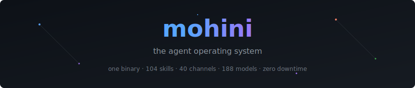
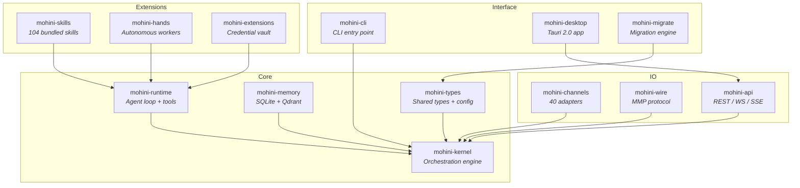
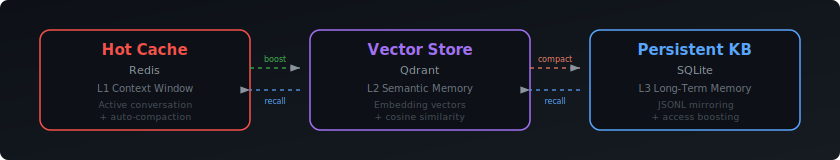

<p align="center">
  
</p>

<p align="center">
  <a href="https://github.com/darshjme/mohini/actions"></a>
  <a href="https://crates.io/crates/mohini-cli"></a>
  <a href="#license"></a>
  
  
  
</p>

<p align="center">
  <a href="#what-is-mohini">What is Mohini</a> &middot;
  <a href="#quick-start">Quick Start</a> &middot;
  <a href="#architecture">Architecture</a> &middot;
  <a href="#features">Features</a> &middot;
  <a href="#channel-adapters">Channels</a> &middot;
  <a href="#model-integrations">Models</a> &middot;
  <a href="#contributing">Contributing</a>
</p>

---

## What is Mohini

Mohini is a single Rust binary that turns AI models into autonomous agents. It browses the web, manages files, sends messages across 40 platforms, executes sandboxed code, and orchestrates multi-agent workflows -- all without human intervention.

Fourteen crates compile to one static binary with no runtime dependencies. Deploy it on bare metal, Docker, Kubernetes, or a Raspberry Pi. It self-heals on crash, hot-reloads config, and falls back across 188 models from every major provider without dropping a message.

---

<p align="center">
  
</p>

---

## Quick Start

### Prerequisites

| Tool | Version | Install |
|------|---------|---------|
| Rust | 1.75+ | `curl --proto '=https' --tlsv1.2 -sSf https://sh.rustup.rs \| sh` |
| C toolchain | gcc / clang | Ubuntu: `sudo apt install build-essential pkg-config libssl-dev` |
| | | macOS: `xcode-select --install` |

### Build from Source

```bash
git clone https://github.com/darshjme/mohini.git
cd mohini
cargo build --release
./target/release/mohini
```

### Docker

```bash
docker run -d \
  --name mohini \
  -v ./mohini.toml:/app/mohini.toml \
  -v ./agents:/app/agents \
  -v ./data:/app/data \
  -p 4200:4200 \
  darshjme/mohini:latest
```

### Your First Agent

Create `agents/my-first-agent/agent.toml`:

```toml
[agent]
id = "my-agent"
name = "My First Agent"
model = "anthropic/claude-sonnet-4-5"
thinking = "low"

[agent.instructions]
preamble = """
You are a focused agent. No fluff. Just results.
"""

[agent.bindings]
channels = ["whatsapp:direct:+1234567890"]
```

Start Mohini and send a WhatsApp message to the configured number. Your agent wakes up.

---

## Architecture



Mohini is composed of **14 Rust crates** that compile into a single static binary:

| Crate | Purpose |
|-------|---------|
| `mohini-kernel` | Orchestration engine -- workflow scheduling, RBAC, heartbeat, cron, hot-reload |
| `mohini-runtime` | Agent loop, LLM drivers, 53 built-in tools, WASM sandbox, MCP client/server |
| `mohini-types` | Shared types, configuration, errors, manifest signing (Ed25519) |
| `mohini-memory` | SQLite + Qdrant vector memory, usage tracking, JSONL mirroring |
| `mohini-api` | Axum REST/WS/SSE server, 76 endpoints, 14-page SPA dashboard |
| `mohini-channels` | 40 messaging adapters with auth, rate limiting, media handling |
| `mohini-wire` | MMP wire protocol -- TCP P2P with HMAC-SHA256 mutual authentication |
| `mohini-skills` | Skill registry + 104 bundled skills, prompt injection scanning |
| `mohini-hands` | 8 autonomous hands (persistent background workers) |
| `mohini-extensions` | Extension system, AES-256-GCM credential vault, OAuth2 PKCE |
| `mohini-cli` | CLI entry point with daemon auto-detect |
| `mohini-desktop` | Tauri 2.0 native desktop application |
| `mohini-migrate` | Migration engine from other agent frameworks |

### Key Patterns

- **`KernelHandle` trait** -- Defined in `mohini-runtime`, implemented on `MohiniKernel` in `mohini-kernel`. Avoids circular crate dependencies while enabling inter-agent tools.
- **Capability-based security** -- Every agent operation is checked against granted capabilities before execution.
- **Daemon detection** -- The CLI checks `~/.mohini/daemon.json` and pings the health endpoint. If a daemon is running, commands use HTTP; otherwise, they boot an in-process kernel.
- **Shared memory** -- Cross-agent KV namespace via a fixed UUID for inter-agent state sharing.

---

## Memory

<p align="center">
  
</p>

- **L1 Context Window** -- Active conversation with automatic compaction when limits are reached.
- **L2 Semantic Memory** -- Embedding vectors with cosine similarity retrieval via Qdrant.
- **L3 Long-Term Memory** -- Persistent knowledge base in SQLite with JSONL mirroring and access-count boosting.
- **Auto-decay** -- Old memories fade unless frequently accessed. Recalled memories stay fresh.

---

## Features

<details>
<summary><strong>Core Engine</strong></summary>
<br>

- **14 Rust crates** -- Modular, zero-copy architecture. Each crate compiles independently.
- **104 bundled skills** + 109 community skills across 30 categories. WASM-sandboxed execution.
- **53 built-in tools** -- File I/O, web fetch, shell exec, code analysis, image processing, audio transcription.
- **Dual-backend vector memory** -- SQLite (embedded, zero-config) or Qdrant (production-scale ANN search).
- **2,285+ tests** -- Every commit validated. Zero clippy warnings enforced in CI.

</details>

<details>
<summary><strong>Shadow Spawning (Multi-Agent Orchestration)</strong></summary>
<br>

- **Fan-out / Fan-in** -- Spawn N sub-agents in parallel, aggregate results when all complete.
- **Chain of Command** -- Hierarchical agent delegation with mission handoff and knowledge base inheritance.
- **Lifecycle management** -- Agents spawn with a mission, execute, report, and self-terminate.
- **MMP Protocol** -- Distributed multi-agent coordination across the network via TCP with HMAC-SHA256 mutual auth.

</details>

<details>
<summary><strong>Autonomous Hands</strong></summary>
<br>

Persistent workers that run independently until their mission completes:

| Hand | Purpose |
|------|---------|
| Researcher | Deep web research with source citations |
| Browser | Headless Chrome automation and scraping |
| Trader | Market data analysis and signal detection |
| Collector | Data aggregation and ETL pipelines |
| Predictor | Time-series forecasting engine |
| Lead-Gen | Sales prospecting and enrichment |
| Clip | Video and audio processing workflows |

</details>

<details>
<summary><strong>Self-Healing</strong></summary>
<br>

- **Process crash** -- systemd restarts within 5 seconds. Sessions reconnect. No message loss.
- **Context overflow** -- Automatic compaction. Conversation continues with summarized history.
- **Model rate limit** -- Transparent fallback to alternate models. Response quality degrades gracefully, never stops.
- **Config change** -- Hot reload without restart. Zero downtime.

</details>

<details>
<summary><strong>WASM Skills</strong></summary>
<br>

Skills execute in a WASM sandbox with fine-grained capability grants. Each skill declares its required permissions in a manifest, and the runtime enforces them at execution time.

- 104 bundled skills + 109 community contributions across 30 categories
- Ed25519 manifest signing for supply chain integrity
- Prompt injection scanning on all skill outputs
- Hot-loadable without process restart

</details>

<details>
<summary><strong>Developer Experience</strong></summary>
<br>

- **Web dashboard** -- Alpine.js SPA at `localhost:4200`. 14 pages. No React bloat.
- **A2UI Canvas** -- Interactive visual canvas for agent output.
- **Voice wake** -- Configurable wake word detection.
- **Media pipeline** -- MIME detection, image optimization (WebP), audio transcription (Whisper).
- **OpenAI-compatible API** -- Drop-in `/v1/chat/completions` endpoint.

</details>

---

## Channel Adapters

Mohini ships with 40 channel adapters for real-time bidirectional messaging:

| Category | Channels |
|----------|----------|
| **Messaging** | WhatsApp, Telegram, Signal, iMessage, Facebook Messenger, Viber, LINE, WeChat |
| **Team Chat** | Discord, Slack, Microsoft Teams, Google Chat, Mattermost, Rocket.Chat, Zulip |
| **Social** | X (Twitter), Reddit, LinkedIn, Instagram, Mastodon, Bluesky |
| **Email** | SMTP/IMAP, Gmail, Outlook |
| **Developer** | Matrix, IRC, GitHub, GitLab |
| **Voice** | Twilio, Vonage |
| **Web** | WebSocket gateway, REST webhook, SSE |
| **Custom** | Bring your own adapter via the `ChannelAdapter` trait |

Each adapter handles authentication, rate limiting, message formatting, and media attachments natively.

---

## Model Integrations

188 models across all major providers with automatic fallback routing:

| Provider | Models |
|----------|--------|
| **Anthropic** | Claude Opus 4.6, Claude Sonnet 4.5, Claude Haiku 4 |
| **OpenAI** | GPT-4o, o1, o3, GPT-4 Turbo |
| **Google** | Gemini 3 Pro, Gemini 2 Flash, Gemini 2 Pro |
| **Meta** | Llama 3.3 70B, Llama 3.1 405B |
| **Mistral** | Mistral Large, Mixtral 8x22B, Codestral |
| **NVIDIA NIM** | Nemotron, community models |
| **Groq** | Ultra-fast inference for Llama, Mixtral |
| **Local** | Ollama, vLLM, LM Studio, llama.cpp |

If your primary model rate-limits, Mohini transparently switches to the next available provider. No dropped messages.

---

## Configuration

Mohini is configured via `mohini.toml`:

```toml
[runtime]
default_model = "anthropic/claude-opus-4-6"
fallback_model = "groq/llama-3.3-70b-versatile"
thinking = "low"
max_agents = 100

[memory]
backend = "sqlite"
decay_rate = 0.95
embedding_model = "sentence-transformers/all-MiniLM-L6-v2"

[channels]
whatsapp = { enabled = true, phone = "+1234567890" }
telegram = { enabled = true, token = "..." }
discord  = { enabled = true, token = "..." }

[hands]
researcher = { enabled = true, max_concurrent = 5 }
browser    = { enabled = true, headless = true }
```

See [`mohini.toml.example`](mohini.toml.example) for the full reference.

---

## Contributing

```bash
git clone https://github.com/darshjme/mohini.git
cd mohini

# Build
cargo build --workspace

# Test (2,285+ tests must pass)
cargo test --workspace

# Lint (zero warnings enforced)
cargo clippy --workspace --all-targets -- -D warnings

# Format
cargo fmt --all
```

See [CONTRIBUTING.md](CONTRIBUTING.md) for the full guide.

---

## License

Dual-licensed under your choice of:

- [Apache License, Version 2.0](LICENSE-APACHE)
- [MIT License](LICENSE-MIT)

---

<p align="center">
  <sub><a href="https://darshj.me">darshj.me</a></sub>
</p>
