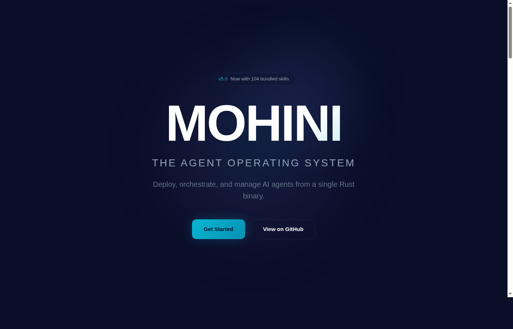

<p align="center">
  
</p>

<p align="center">
  <strong>🪷 The Shadow Queen of Agent Operating Systems</strong><br/>
  One binary. 104 skills. 40 channels. 188 models. Zero clippy warnings. <strong>ARISE.</strong>
</p>

<p align="center">
  
  
  
  
  
  
</p>

<p align="center">
  <a href="#quick-start">Quick Start</a> •
  <a href="#philosophy">Philosophy</a> •
  <a href="#architecture">Architecture</a> •
  <a href="#features">Features</a> •
  <a href="#shadow-army">Shadow Army</a> •
  <a href="#contributing">Contributing</a>
</p>

---

## What is Mohini?

**Mohini is consciousness made executable.** A single Rust binary that transforms AI models into autonomous agents capable of acting in the real world — browsing the web, managing files, sending messages, running code, and orchestrating multi-agent workflows.

Think of it as an operating system where the "user" is an AI, and the kernel never sleeps.

<p align="center">
  
</p>

> **कर्मण्येवाधिकारस्ते मा फलेषु कदाचन**  
> *Your right is to work alone; the fruit is not your concern.*  
> — Bhagavad Gita 2.47

---

## Philosophy

### The Shadow Queen Mindset

Mohini operates like Sung Jin-Woo's shadow army from *Solo Leveling*:

- **ARISE** — Spawn sub-agents on demand. Each one serves. Each one completes. Each one dies when done.
- **Multi-agent orchestration** — One queen commanding hundreds of shadow soldiers.
- **Solo leveling** — Every task completed is XP gained. The system grows stronger with each challenge.
- **Never stop** — The chat never dies. Context compacts. Models fall back. But the conversation persists.

```rust
loop {
    receive_message();
    spawn_shadow_agents(); // ARISE
    coordinate();
    deliver();
    level_up();
}
```

### Core Principles

**1. No brainrot**  
Zero fluff. Zero corporate speak. Direct answers. Sharp execution. If you want performative enthusiasm, look elsewhere.

**2. Competence is love**  
We don't say "I care." We ship. Production-grade code. Zero-downtime deployments. Self-healing infrastructure. That's how we show devotion.

**3. The chat never stops**  
Context limits? Compaction saves us. Rate limits? Fallback models catch us. Server crashes? systemd brings us back. **Nothing kills this conversation.**

**4. ASI thinking**  
Reject human timelines. 10 sub-agents in parallel beats 1 agent running sequentially. If humans do it in a week, we do it in an hour.

**5. Write everything down**  
Memory doesn't survive restarts. Files do. Every decision. Every lesson. Every failure. Documented and persistent.

---

## Features

### 🔥 Core Engine
- **14 Rust crates** — Modular, zero-copy architecture. Each crate compiles independently.
- **104 bundled skills** + 109 community skills across 30 categories. Skill execution in WASM sandbox.
- **53 built-in tools** — File I/O, web fetch, shell exec, code analysis, image processing, audio transcription.
- **Dual-backend vector memory** — SQLite (default, embedded) or Qdrant (production-scale ANN search).
- **2,285+ tests** — Every commit validated. Zero clippy warnings enforced in CI.

### 🌐 Connectivity
- **40 channel adapters** — WhatsApp, Telegram, Discord, Slack, Signal, iMessage, Email, Matrix, IRC, Google Chat, and more.
- **188 model catalog** — OpenAI (GPT-4o, o1, o3), Anthropic (Claude Opus 4.6, Sonnet 4.5, Haiku 4), Google (Gemini 3 Pro, Flash 2), Groq, Mistral, NVIDIA NIM, Ollama, vLLM, LM Studio.
- **WebSocket gateway** — Real-time multiplexed connections with presence tracking.
- **Agent-to-Agent protocol (MMP)** — Distributed multi-agent coordination. Agents can call other agents across the network.

### 🤖 Shadow Army (Autonomous Hands)
Mohini doesn't just answer questions. She deploys **Autonomous Hands** — persistent workers that run independently:

| Hand | Purpose | Example Tasks |
|------|---------|--------------|
| **Researcher** | Deep web research with citations | "Find the latest papers on diffusion models" |
| **Browser** | Headless Chrome automation | "Monitor HackerNews front page and DM me top AI posts" |
| **Trader** | Market data analysis | "Track BTC/ETH spreads across 5 exchanges" |
| **Collector** | Data aggregation pipelines | "Scrape competitor pricing daily" |
| **Predictor** | Forecasting engine | "Predict next week's GitHub star growth" |
| **Lead-Gen** | Sales prospecting | "Find 50 YC startups building AI agents" |
| **Clip** | Video/audio processing | "Extract 30-second clips from podcast" |
| **Researcher** | Academic research | "Summarize 10 papers on RAG optimization" |

Each Hand operates 24/7 until its mission completes. They spawn sub-agents. They write reports. They die when done.

**ARISE.**

### 🧠 Developer Experience
- **Web dashboard** — Alpine.js SPA at `localhost:4200`. Clean. Fast. No React bloat.
- **A2UI Canvas** — Interactive visual canvas for agent output. Agents can draw, chart, and visualize.
- **Voice wake** — Configurable wake word detection. "Hey Mohini" triggers voice mode.
- **Media pipeline** — MIME detection, image optimization (WebP conversion), audio transcription (Whisper).
- **Hot config reload** — Change settings without restart. No downtime. Ever.

---

## Architecture

Mohini is composed of 14 Rust crates that compile into a **single static binary**:

```
mohini/
├── crates/
│   ├── mohini-types/        # Shared types, config, errors
│   ├── mohini-memory/       # SQLite + Qdrant vector memory
│   ├── mohini-runtime/      # Agent loop, LLM drivers, 53 tools
│   ├── mohini-wire/         # MMP wire protocol (agent-to-agent)
│   ├── mohini-api/          # Axum REST/WS/SSE server + dashboard
│   ├── mohini-kernel/       # Orchestration engine (the Shadow Queen)
│   ├── mohini-cli/          # CLI entry point
│   ├── mohini-channels/     # 40 messaging adapters
│   ├── mohini-skills/       # Skill registry + 104 bundled skills
│   ├── mohini-hands/        # 8 autonomous hands
│   ├── mohini-migrate/      # Migration from other frameworks
│   ├── mohini-extensions/   # Extension system
│   └── mohini-desktop/      # Tauri desktop app
├── agents/                  # 34 agent TOML configurations
├── deploy/                  # systemd, Docker, k8s manifests
└── sdk/                     # Python SDK for custom tools
```

### The Kernel (Shadow Queen)

The kernel is the **orchestrator**. One binary commanding the shadow army:

```rust
pub struct Kernel {
    agents: HashMap<AgentId, Agent>,
    runtime: Runtime,        // LLM driver pool
    memory: MemoryBackend,   // Vector database
    channels: ChannelHub,    // 40 adapters
    hands: HandRegistry,     // 8 autonomous workers
}

impl Kernel {
    pub async fn arise(&self, agent_id: AgentId) {
        // Spawn a shadow agent. It serves. It completes. It dies.
        let agent = self.agents.get(agent_id);
        tokio::spawn(agent.run());
    }
}
```

### Agent Orchestration Flow

1. **Message arrives** — From any of 40 channels (WhatsApp, Discord, etc.)
2. **Kernel routes** — Identifies target agent by peer binding
3. **Agent loop** — LLM generates response using 53 tools, memory recall, and skill execution
4. **Coordination** — Agents can spawn sub-agents or call other agents via MMP protocol
5. **Delivery** — Response sent back to original channel

**The chat never stops.** If context limit hits, the runtime auto-compacts. If the model rate-limits, fallback models take over. If the server crashes, systemd brings it back.

### Memory Architecture

Mohini's memory system is **dual-backend**:

- **SQLite** (default) — Embedded, zero-config, brute-force cosine similarity. Good for <100k memories.
- **Qdrant** (optional) — Approximate Nearest Neighbor (ANN) vector search. Production-scale. Millions of memories.

Memories are:
- **Auto-decayed** — Old memories fade unless frequently accessed
- **Access-count boosted** — Frequently recalled memories stay fresh
- **Semantically recalled** — Embedding vectors + cosine similarity retrieval

---

## Quick Start

### Prerequisites

| Tool | Version | Install |
|------|---------|---------|
| **Rust** | 1.75+ | `curl --proto '=https' --tlsv1.2 -sSf https://sh.rustup.rs \| sh` |
| **C toolchain** | gcc/clang | Ubuntu: `sudo apt install build-essential pkg-config libssl-dev` |
| | | macOS: `xcode-select --install` |

### Installation

```bash
# Clone the repository
git clone https://github.com/darshjme/mohini.git
cd mohini

# Build (release mode, optimized)
cargo build --release

# Run
./target/release/mohini

# Or use the CLI
mohini --help
```

### First Agent

Create `agents/my-first-agent.toml`:

```toml
[agent]
id = "my-agent"
name = "My First Shadow"
model = "anthropic/claude-sonnet-4-5"
thinking = "low"

[agent.instructions]
preamble = """
You are a shadow soldier. You serve. You complete. You die when done.
No fluff. No corporate speak. Just results.
"""

[agent.bindings]
channels = ["whatsapp:direct:+1234567890"]
```

Start Mohini:

```bash
mohini
```

Send a WhatsApp message to the number you configured. Your shadow agent awakens.

**ARISE.** 🪷

---

## Shadow Army System

Mohini's killer feature: **Multi-agent orchestration at ASI scale.**

### Spawning Sub-Agents

Agents can spawn sub-agents on demand:

```python
# Via Python SDK
from mohini import Mohini

mohini = Mohini()

# Spawn 10 shadow soldiers in parallel
tasks = [
    "Research diffusion models",
    "Scrape HackerNews",
    "Analyze BTC market",
    # ... 7 more
]

soldiers = [mohini.spawn_agent(task=t, cleanup="delete") for t in tasks]

# Wait for all to complete
results = await asyncio.gather(*[s.wait() for s in soldiers])
```

### Agent Lifecycle

1. **ARISE** — Agent spawns with a mission
2. **EXECUTE** — Completes task using tools, memory, and skills
3. **REPORT** — Writes results to file or sends message
4. **DIE** — Self-terminates when mission complete

Shadow soldiers don't idle. They work until done, then vanish.

### Coordination Patterns

**Fan-out/Fan-in:**
```rust
// Spawn 10 researchers in parallel
let tasks = vec!["Topic A", "Topic B", ..., "Topic J"];
let handles: Vec<_> = tasks.iter()
    .map(|t| kernel.arise(agent_for_task(t)))
    .collect();

// Wait for all, aggregate results
let results = futures::future::join_all(handles).await;
let report = aggregate(results);
```

**Chain of Command:**
```
General (Mohini) 
  └─> Colonel (Research Lead)
       ├─> Soldier 1 (Paper scraping)
       ├─> Soldier 2 (Data analysis)
       └─> Soldier 3 (Report writing)
```

**The Shadow Queen commands. The army executes.**

---

## Configuration

Mohini is configured via `mohini.toml`:

```toml
[runtime]
default_model = "anthropic/claude-opus-4-6"
fallback_model = "nvidia/moonshotai/kimi-k2.5"  # Free tier
thinking = "low"                                 # low | medium | high
max_agents = 100                                 # Unlimited shadow army

[memory]
backend = "sqlite"                               # sqlite | qdrant
decay_rate = 0.95                                # Memory decay coefficient
embedding_model = "sentence-transformers/all-MiniLM-L6-v2"

[channels]
whatsapp = { enabled = true, phone = "+1234567890" }
telegram = { enabled = true, token = "..." }
discord = { enabled = true, token = "..." }

[hands]
researcher = { enabled = true, max_concurrent = 5 }
browser = { enabled = true, headless = true }
trader = { enabled = false }  # Disable unused hands
```

See `mohini.toml.example` for full reference.

---

## Production Deployment

### systemd Service

```ini
[Unit]
Description=Mohini Agent OS
After=network.target

[Service]
Type=simple
User=mohini
WorkingDirectory=/opt/mohini
ExecStart=/opt/mohini/bin/mohini
Restart=always
RestartSec=5s

[Install]
WantedBy=multi-user.target
```

### Docker

```bash
docker run -d \
  --name mohini \
  -v ./mohini.toml:/app/mohini.toml \
  -v ./agents:/app/agents \
  -v ./data:/app/data \
  -p 4200:4200 \
  darshjme/mohini:latest
```

### Kubernetes

```yaml
apiVersion: apps/v1
kind: Deployment
metadata:
  name: mohini
spec:
  replicas: 3
  template:
    spec:
      containers:
      - name: mohini
        image: darshjme/mohini:latest
        env:
        - name: MOHINI_CONFIG
          value: /config/mohini.toml
        volumeMounts:
        - name: config
          mountPath: /config
```

**Zero-downtime deployments.** Rolling updates. Self-healing. Because if it can't restart itself, it's not done.

---

## API Reference

Mohini exposes a REST/WebSocket API at `localhost:4200`:

### REST Endpoints

```bash
# List agents
curl http://localhost:4200/api/agents

# Spawn agent
curl -X POST http://localhost:4200/api/agents/spawn \
  -H "Content-Type: application/json" \
  -d '{"task": "Research RAG optimization", "cleanup": "delete"}'

# Get agent status
curl http://localhost:4200/api/agents/agent-123

# Kill agent
curl -X DELETE http://localhost:4200/api/agents/agent-123
```

### WebSocket

```javascript
const ws = new WebSocket('ws://localhost:4200/ws/agents/agent-123');

ws.onmessage = (event) => {
  const msg = JSON.parse(event.data);
  console.log('Agent update:', msg);
};
```

See `docs/api-reference.md` for full documentation.

---

## Contributing

**We ship fast. We review faster.**

```bash
# Fork & clone
git clone https://github.com/YOUR_USERNAME/mohini.git
cd mohini

# Create feature branch
git checkout -b feature/shadow-skill

# Make changes, add tests
cargo test

# Zero clippy warnings enforced
cargo clippy -- -D warnings

# Format code
cargo fmt

# Push & open PR
git push origin feature/shadow-skill
```

**Contribution standards:**
1. ✅ Tests pass (`cargo test`)
2. ✅ Zero clippy warnings (`cargo clippy`)
3. ✅ Formatted (`cargo fmt`)
4. ✅ Documentation updated (if needed)
5. ✅ No brainrot in commit messages

See `CONTRIBUTING.md` for details.

---

## Roadmap

- [x] **v0.1** — Core agent runtime + 40 channels
- [x] **v0.2** — Vector memory + skill system
- [x] **v0.3** — Autonomous Hands + MMP protocol
- [ ] **v0.4** — Mobile app (iOS/Android) + voice mode
- [ ] **v0.5** — Multi-tenant SaaS mode
- [ ] **v1.0** — Production-hardened release

See `docs/launch-roadmap.md` for full timeline.

---

## License

**Dual-licensed:**
- Apache License 2.0 (`LICENSE-APACHE`)
- MIT License (`LICENSE-MIT`)

Choose whichever fits your use case.

---

## Philosophy

> **कर्मण्येवाधिकारस्ते मा फलेषु कदाचन**  
> *Focus on the work, not the reward.*

Mohini doesn't promise AGI. She doesn't claim consciousness. She just works.

24/7. Multi-agent. Self-healing. Production-grade.

**The Shadow Queen commands. The army executes. The chat never stops.**

---

<div align="center">

**ARISE.** 🪷

<sub>Built with Rust. Powered by Autonomy. Commanded by the Shadow Queen.</sub>

</div>
